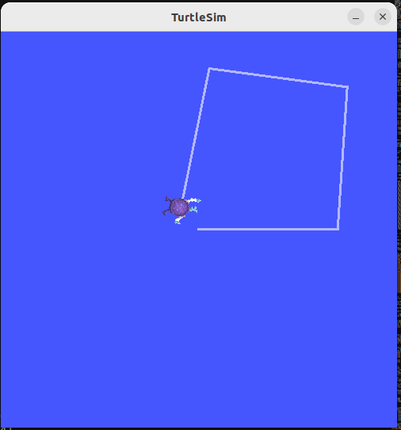
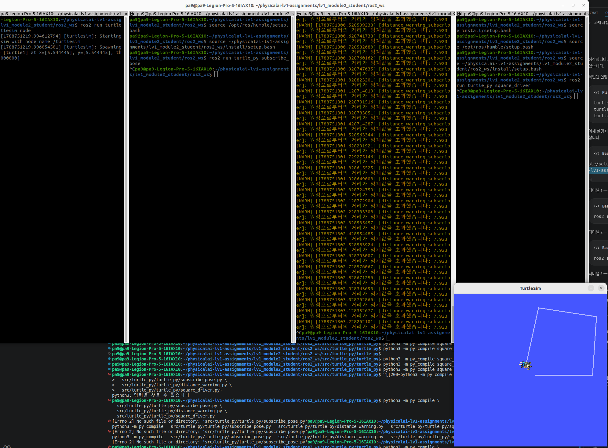

# 모듈 ② 과제 — turtlesim 기반 C++·Python ROS2 패키지 개발

## 문제1. C++ 빌드 체계 세우기 - g++ 다중 파일 빌드와 CMake 전환

### 문제 2-1-1 로봇의 제동 거리를 계산하는 stop_distance.cpp 를 작성해 g++ -Wall -std=c++17 로 빌드·실행하세요. 속도와 마찰계수를 입력받아 정지거리를 출력하면 됩니다. ###

- 파일명: stop_distace.cpp
- 코드: 
```cpp 
//

- stop_distance.cpp — 로봇의 제동(정지) 거리 계산

- 물리: (가정)바퀴와 바닥 사이 마찰이 유일한 제동력  
    - 감속도 a = mu * g (mu: 마찰계수, g: 중력가속도)  
    - 운동에너지 (1/2)m v^2 
    - 마찰력  d = v^2 / (2 * mu * g)  

- 빌드: g++ -Wall -std=c++17 stop_distance.cpp -o stop_distance  
- 실행: ./stop_distance  
- <속도[m/s]> <마찰계수>인자를 안 주면 값을 직접 입력받는다.  
//  

#include <iostream>
double g_acc = 9.81;

double computeStopDistance(double speed, double mu = 0.15){
    return speed * speed / (2.0 * mu * g_acc);
}

int main() {
    double speed = 0.0;
    double mu = 0.0;

    std::cout << "속도 입력:";
    std::cin >> speed ;

    std::cout << "마찰계수 입력:";
    std::cin >> mu ;

    if (mu <= 0) {
        std::cout << "마찰계수는 0보다 커야 합니다." << std::endl;
        return 1;
    }

    double distance = computeStopDistance(speed, mu);
    std::cout << "정지거리: "<< distance << "m" << std::endl;

    return 0;
}
```

- 빌드: g++ -Wall -Wextra -std=c++17 -o stop_distance stop_distance.cpp
- 실행: ./stop_distance
- 결과: 속도 입력, 마찰계수 입력, 정지거리 출력
    - 예시: 속도 입력:12, 마찰계수 입력: 1.1, 정지러기: 6.67223m

### 문제 2-1-2 모터를 표현하는 Motor 클래스를 motor.hpp 와 motor.cpp 로 분리하고 main.cpp 에서 사용하세요. 세 파일을 컴파일과 링크 두 단계로 나누어 수동 빌드합니다.

- 파일명: motor.hpp
- 코드: 
```cpp 
#pragma once // 중복 include 방지
class Motor{
    public:
        void setSpeed(double mps);
    private:
        double current_speed_ = 0.0;
};
```

```cpp
- 파일명: motor.cpp
- 코드: 
#include <iostream>
#include "motor.hpp"

void Motor::setSpeed(double mps){
    current_speed_=mps;
}
```


- 파일명: main.cpp
- 코드: 
```cpp
#include "iostream"
#include "motor.hpp"

int main(){
    double v = 1.2;

    Motor my_motor;
    my_motor.setSpeed(v);
    std::cout << "motor 속도 = "<< v <<std::endl;
    return 0;
};
```
- 빌드: 
    1. g++ -Wall -Wextra -O2 -std=c++17 -c motor.cpp
    2. g++ -Wall -Wextra -O2 -std=c++17 -c main.cpp
    3. g++ main.o motor.o -o main_motor

### 문제 2-1-3 링크 단계에서 motor.o 를 일부러 빼고 빌드해 undefined reference 에러를 재현하고, 이것이 컴파일 에러와 어떻게 다른지 설명하세요.

- 빌드 과정:  
    1. g++ -c main.cpp
    2. g++ -c motor.cpp
    3. g++ main.o -o main_motor
- 결과:
```terminal
 g++ main.o -o main_motor/usr/bin/ld: main.o: in function `main':

main.cpp:(.text+0x42): undefined reference to `Motor::setSpeed(double)'

collect2: error: ld returned 1 exit status
```

### 문제 2-1-4 같은 프로젝트를 CMakeLists.txt 로 옮겨 cmake .. && make 로 빌드하세요.

- 파일명: CMakeLists.txt
- 내용:
```
cmake_minimum_required(VERSION 3.10)


project(MotorProject CXX)


set(CMAKE_CXX_STANDARD 17)


add_executable(main_motor main.cpp motor.cpp)
```
- 빌드: 
    1. cmake ..
    2. make
    3. ./main_motor

### 문제 2-1-5 motor.cpp 만 수정한 뒤 다시 make 했을 때 어떤 파일만 재컴파일되는지 출력으로 확인하고, 증분 빌드가 무엇을 근거로 판단하는지 서술하세요.

- 파일명: motor.cpp
- 코드:
```cpp
#include <iostream>
#include "motor.hpp"

void Motor::setSpeed(double mps){
    current_speed_=mps;
    std::cout <<"Motor's speed revised to  " << current_speed_<< "m/s" << std::endl;
}
```

- 빌드:
    1. make
- 결과:
    - [ 33%] Building CXX object CMakeFiles/main_motor.dir/main.cpp.o
    - [ 66%] Building CXX object CMakeFiles/main_motor.dir/motor.cpp.o
    - [100%] Linking CXX executable main_motor
    - [100%] Built target main_motor
    수정한 motor.cpp 파일만 재컴파일됨
- 근거: 
    - 타임스탬프 비교: 수정한 motor.cpp 파일의 최종 수정 시간을 이전에 생성된 motor.cpp.o 생성 시간과 비교합니다.

## 문제 2. 현대 C++로 센서 계층 구현 - RAII·다형성·STL

### 문제 2-2-1. 순수 가상 함수 `read()` 를 가진 추상 클래스 `Sensor` 를 정의하고, 이를 상속한 `Lidar` 와 `Imu` 를 구현하세요. **가상 소멸자를 반드시 선언**합니다.

 - 파일명: sensor.hpp 
 - 코드:
 ```cpp
 #ifndef SENSOR_HPP
#define SENSOR_HPP

#include <iostream>

// 1. 추상 기반 클래스 (Abstract Base Class)
class Sensor {
public:
    // 가상 소멸자 (Virtual Destructor) - 필수!
    // 다형성을 이용해 Sensor* 포인터로 자식 객체를 delete 할 때 
    // 자식 클래스의 소멸자가 정상 호출되도록 보장합니다.
     virtual ~Sensor() {
        std::cout << "[Sensor] Base Destructor Called" << std::endl;
    }

    // 순수 가상 함수 (Pure Virtual Function)
    // 뒤에 '= 0'을 붙여 추상 클래스로 만들고, 자식 클래스에서 반드시 구현하도록 강제합니다.
    virtual void read() = 0;
};

// 2. Lidar 클래스 (Sensor 상속)
class Lidar : public Sensor {
public:
    ~Lidar() override{
        std::cout << "[Lidar] Destructor Called" << std::endl;
    }

    // 순수 가상 함수 구현 (override 명시)
    void read() override {
        std::cout << "[Lidar] 2D Point Cloud 데이터를 스캔합니다." << std::endl;
    }
};

// 3. Imu 클래스 (Sensor 상속)
class Imu : public Sensor {
public:
    ~Imu() override {
        std::cout << "[Imu] Destructor Called" << std::endl;
    }

    // 순수 가상 함수 구현 (override 명시)
    void read() override {
        std::cout << "[IMU] 관성 가속도 및 각속도 데이터를 측정합니다." << std::endl;
    }
};

#endif // SENSOR_HPP
```

### 문제 2-2-2. 두 센서를 `std::vector<std::unique_ptr<Sensor>>` 에 담아 다형성 루프로 읽으세요. 가상 소멸자를 일부러 빼 보고 동작 차이를 관찰해 기록하세요.
- 다형성 루프 읽기
    - 가상 소멸자 O
    - 출력 결과:
```bash
pa9@pa9-Legion-Pro-5-16IAX10:~/physicalai-lv1-assignments/lv1_module2_student/cpp_basics/sensors$ g++ -Wall -Wextra -O2 -std=c++17 -o main_sensors main.cpp
pa9@pa9-Legion-Pro-5-16IAX10:~/physicalai-lv1-assignments/lv1_module2_student/cpp_basics/sensors$ ./main_sensors
=== 1. std::vector<std::unique_ptr<Sensor>> 다형성 루프 실행 ===
[Lidar] 2D Point Cloud 데이터를 스캔합니다.
[IMU] 관성 가속도 및 각속도 데이터를 측정합니다.

=== 2. 프로그램 종료 (스마트 포인터 자동 해제 시점) ===
[Lidar] Destructor Called
[Sensor] Base Destructor Called
[Imu] Destructor Called
[Sensor] Base Destructor Called
```

    - 가상 소멸자 X -> virtual 삭제
    - 출력 결과:
```bash
pa9@pa9-Legion-Pro-5-16IAX10:~/physicalai-lv1-assignments/lv1_module2_student/cpp_basics/sensors$ g++ -Wall -Wextra -O2 -std=c++17 -o main_sensors main.cpp
In file included from main.cpp:4:
Sensor.hpp:24:5: error: ‘Lidar::~Lidar()’ marked ‘override’, but does not override
   24 |     ~Lidar() override {
      |     ^
Sensor.hpp:37:5: error: ‘Imu::~Imu()’ marked ‘override’, but does not override
   37 |     ~Imu() override {
      |     ^
```
```bash
# override 제거
pa9@pa9-Legion-Pro-5-16IAX10:~/physicalai-lv1-assignments/lv1_module2_student/cpp_basics/sensors$ ./sensors_demo
=== 1. std::vector<std::unique_ptr<Sensor>> 다형성 루프 실행 ===
[Lidar] 2D Point Cloud 데이터를 스캔합니다.
[IMU] 관성 가속도 및 각속도 데이터를 측정합니다.

=== 2. 프로그램 종료 (스마트 포인터 자동 해제 시점) ===
[Sensor] Base Destructor Called
[Sensor] Base Destructor Called
```
- 상세 설명:
    - 각 센서의 read() 가 동적으로 선택됨
    - 프로그램 종료 시 unique_ptr가 객체를 자동 해제
    - 자식 소멸자 다음에 부모 소멸자 호출됨
- 가상 소멸자를 제거했을 때 결과
    - 처음 발생한 override 컴파일 오류
    - override도 임시 제거한 후 직접 확인한 실행 결과
    
### 문제 2-2-3. 지역 변수로 만든 객체와 `std::make_unique` 로 만든 객체가 각각 **언제 소멸하는지** 소멸자에 출력을 넣어 관찰하고, 스택과 힙의 차이로 설명하세요.

- 코드:
```cpp
    std::cout << "스택 시작" << std::endl;
    {
        Lidar lidar;
        lidar.read();
    } // 지역 객체 lidar가 블록 끝에서 자동 소멸
    std::cout << "스택 종료" << std::endl;

    std::cout << "힙 시작" << std::endl;
    {
        std::unique_ptr<Imu> imu = std::make_unique<Imu>();
        imu->read();
    } // unique_ptr 가 소멸하면서 힙의 Imu 객체도 자동 소멸 
    std::cout << "힙 종료" << std::endl;
```
```bash
- 출력 결과:
    pa9@pa9-Legion-Pro-5-16IAX10:~/physicalai-lv1-assignments/lv1_module2_student/cpp_basics/sensors$ ./main_sensors
    === 1. std::vector<std::unique_ptr<Sensor>> 다형성 루프 실행 ===
    [Lidar] 2D Point Cloud 데이터를 스캔합니다.
    [IMU] 관성 가속도 및 각속도 데이터를 측정합니다.

    === 2. 프로그램 종료 (스마트 포인터 자동 해제 시점) ===
    스택 시작
    [Lidar] 2D Point Cloud 데이터를 스캔합니다.
    [Lidar] Destructor Called
    [Sensor] Base Destructor Called
    스택 종료
    힙 시작
    [IMU] 관성 가속도 및 각속도 데이터를 측정합니다.
    [Imu] Destructor Called
    [Sensor] Base Destructor Called
    힙 종료
    [Lidar] Destructor Called
    [Sensor] Base Destructor Called
    [Imu] Destructor Called
    [Sensor] Base Destructor Called
```
- 스택과 힙의 차이
    - 스택 객체
    : 블록{} 종료 -> Lidar 객체 수명 종료
    - 힙 객체
    : 블록 종료 -> unique_ptr 수명 종료 -> 힙의 Imu 객체 해제

### 문제 2-2-4. 센서 이름에서 최근 측정값을 찾는 `std::unordered_map` 과 측정 로그 `std::vector` 를 만들고, `std::count_if` 로 목표점까지 거리가 0.35 이내인 기록의 개수를 세세요.

- 코드:
```cpp
    std::unordered_map<std::string, double> latest_measurements = {
        {"lidar", 1.25},
        {"imu", 0.08}
    };
    std::cout << "Lidar 최근 측정값: " << latest_measurements["lidar"] << std::endl;
    std::cout << "Lidar 최근 측정값: " << latest_measurements["imu"] << std::endl;

    std::vector<double> distance_logs ={
        0.20,
        0.35,
        0.50,
        0.10,
        0.40
    };

    auto count = std::count_if(
        distance_logs.begin(),
        distance_logs.end(),
        [](double distance) {
            return distance <= 0.35;
        }
    );
    std::cout << "목표지점까지 거리 0.35 이내 기록: " << count << "개" << std::endl;
```
- 출력 결과:
```bash
pa9@pa9-Legion-Pro-5-16IAX10:~/physicalai-lv1-assignments/lv1_module2_student/cpp_basics/sensors$ ./main_sensors
=== 1. std::vector<std::unique_ptr<Sensor>> 다형성 루프 실행 ===
[Lidar] 2D Point Cloud 데이터를 스캔합니다.
[IMU] 관성 가속도 및 각속도 데이터를 측정합니다.

Lidar 최근 측정값: 1.25
Lidar 최근 측정값: 0.08
목표지점까지 거리 0.35 이내 기록: 3개
```

### 문제 2-2-5. 값을 범위 안으로 자르는 함수 템플릿 `clamp` 를 작성해 `double` 속도와 `int` 픽셀값 **양쪽에 모두** 적용하세요.

- 코드:
```cpp
#include
template <typename T>
T clamp (T value, T min_value, T max_value)
{
    if (value < min_value){
        return min_value;
    }
    if (value > max_value){
        return max_value;
    }
    return value;
}
int main() {
    double speed = 75.0; /* 실험용 속도 */
    double clamped_speed = clamp (speed, 0.0, 60.0);

    int pixel = 800; /* 실험용 픽셀값 */
    int clamped_pixel = clamp(pixel, 0, 729);

    std::cout << "속도 보정 결과: " << speed << "-> " << clamped_speed << std::endl;
    std::cout << "픽셀 보정 결과: " << pixel << "-> " << clamped_pixel << std::endl;
}
```

- 출력 결과:
```bash
=== 4. 데이터 값 보완 ===
속도 보정 결과: 75-> 60
픽셀 보정 결과: 800-> 729
```

### 문제 2-2-6. `new` 로 할당하고 `delete` 하지 않는 루프를 만들어 누수를 재현한 뒤, `-fsanitize=address` 또는 valgrind로 검출하고 `make_unique` 로 바꿔 누수가 사라지는지 확인하세요.

- 검출
- ** 누수 검출 결과**
```bash
=================================================================
==44756==ERROR: LeakSanitizer: detected memory leaks

Direct leak of 80 byte(s) in 10 object(s) allocated from:
    #0 0x71f80aeb61e7 in operator new(unsigned long) ../../../../src/libsanitizer/asan/asan_new_delete.cpp:99
    #1 0x5fe8379078cc in leak_test() /home/pa9/physicalai-lv1-assignments/lv1_module2_student/cpp_basics/sensors/main.cpp:25
    #2 0x5fe837908b4e in main /home/pa9/physicalai-lv1-assignments/lv1_module2_student/cpp_basics/sensors/main.cpp:109
    #3 0x71f80a629d8f in __libc_start_call_main ../sysdeps/nptl/libc_start_call_main.h:58

SUMMARY: AddressSanitizer: 80 byte(s) leaked in 10 allocation(s).
```
- ** 수정 후 결과**
```bash
=== 5. leak test ===
[Lidar] 2D Point Cloud 데이터를 스캔합니다.
[Lidar] Destructor Called
[Sensor] Base Destructor Called
[Lidar] 2D Point Cloud 데이터를 스캔합니다.
[Lidar] Destructor Called
[Sensor] Base Destructor Called
[Lidar] 2D Point Cloud 데이터를 스캔합니다.
[Lidar] Destructor Called
[Sensor] Base Destructor Called
[Lidar] 2D Point Cloud 데이터를 스캔합니다.
[Lidar] Destructor Called
[Sensor] Base Destructor Called
[Lidar] 2D Point Cloud 데이터를 스캔합니다.
[Lidar] Destructor Called
[Sensor] Base Destructor Called
[Lidar] 2D Point Cloud 데이터를 스캔합니다.
[Lidar] Destructor Called
[Sensor] Base Destructor Called
[Lidar] 2D Point Cloud 데이터를 스캔합니다.
[Lidar] Destructor Called
[Sensor] Base Destructor Called
[Lidar] 2D Point Cloud 데이터를 스캔합니다.
[Lidar] Destructor Called
[Sensor] Base Destructor Called
[Lidar] 2D Point Cloud 데이터를 스캔합니다.
[Lidar] Destructor Called
[Sensor] Base Destructor Called
[Lidar] 2D Point Cloud 데이터를 스캔합니다.
[Lidar] Destructor Called
[Sensor] Base Destructor Called
```

## 문제3. rclpy 노드 작성 - 거북이 상태 발행자와 구독자

### 문제 2-3-1. `turtle_py` 패키지를 `ament_python` 빌드 타입으로 만드세요.

- ros2 pkg create [빌드 타입 옵션] [패키지 이름]

- ros2 pkg create ament-python turtle_py
    - 해당 명령어로 실행했을 때, 정상 패키지 생성 안됩니다.

- ros2 pkg create --build-type ament_python turtle_py
    - 올바른 패키지 생성 명령어

 ```bash   
    - 출력 결과:
    pa9@pa9-Legion-Pro-5-16IAX10:~/physicalai-lv1-assignments/lv1_module2_student/ros2_ws/src$ ros2 pkg create --build-type ament_python turtle_py
    going to create a new package
    package name: turtle_py
    destination directory: /home/pa9/physicalai-lv1-assignments/lv1_module2_student/ros2_ws/src
    package format: 3
    version: 0.0.0
    description: TODO: Package description
    maintainer: ['pa9 <ansxodud23@gmail.com>']
    licenses: ['TODO: License declaration']
    build type: ament_python
    dependencies: []
    creating folder ./turtle_py
    creating ./turtle_py/package.xml
    creating source folder
    creating folder ./turtle_py/turtle_py
    creating ./turtle_py/setup.py
    creating ./turtle_py/setup.cfg
    creating folder ./turtle_py/resource
    creating ./turtle_py/resource/turtle_py
    creating ./turtle_py/turtle_py/__init__.py
    creating folder ./turtle_py/test
    creating ./turtle_py/test/test_copyright.py
    creating ./turtle_py/test/test_flake8.py
    creating ./turtle_py/test/test_pep257.py
```

### 문제 2-3-2. `ros2 run turtlesim turtlesim_node` 로 거북이를 띄우고, `ros2 topic echo /turtle1/pose` 로 어떤 필드가 오는지 먼저 확인해 기록하세요.
- 터미널 2개 실행

- 첫 번째 터미널(T_1st)
    - ros2 run turtlesim turtlesim_node
    - 거북이 생성 -> 정상 결과

- 두 번째 터미널 (T_2nd)
```bash
    - ros2 topic echo /turtle1/pose
        - 토픽으로 계속 발행되는 거북이의 현재 자세, 속도를 출력
        - 초기 거북이 위치가 화면 중앙이 아니라 왼쪽 아래쪽에 위치 -> 원점이 아닌 (5.54, 5.54)에 위치
    - 출력 결과:

    ---
    x: 5.544444561004639
    y: 5.544444561004639
    theta: 0.0
    linear_velocity: 0.0
    angular_velocity: 0.0
    ---
```

```bash
    - ros2 topic type /turtle1/pose
        - 메세지 타입 확인 명령어
    - 출력 결과:
    ^Cpa9@pa9-Legion-Pro-5-16IAX10:~$ ros2 topic type /turtle1/pose
    turtlesim/msg/Pose
    [메세지를 정의한 ros2 패키지][인터페이스 종류가 메시지][메세지 타입 이름]
```
```bash
    - ros2 interface show $(ros2 topice type /turtle1/pose)
        - 메세지 구조 자체 확인 명령어
    - 출력 결과:
    pa9@pa9-Legion-Pro-5-16IAX10:~$ ros2 interface show $(ros2 topic type /turtle1/pose)
    float32 x
    float32 y
    float32 theta

    float32 linear_velocity
    float32 angular_velocity
```

### 문제 2-3-3. `/turtle1/pose` 를 구독해 **원점에서의 거리**를 계산하고, 그 값을 `/turtle_distance` 토픽에 `std_msgs/msg/Float32` 타입으로 **10Hz** 발행하는 노드를 rclpy 로 작성하세요. 구독 콜백은 최신 자세를 보관만 하고, 발행은 **타이머 콜백**에서 하세요.
- topic: /turtle_distance
- msg type: std_msgs/msg/Float32
- 주기: 10Hz
- 소스 파일: subscribe_pose.py
- 코드:
```python
def pose_callback(self, msg):
    self.latest_pose = msg

def timer_callback(self):
    if self.latest_pose is None:
        return

    distance = math.hypot(
        self.latest_pose.x,
        self.latest_pose.y
    )

    message = Float32()
    message.data = float(distance)
    self.publisher.publish(message)
```
```bash

- /turtle_distance 발행 주기 확인
- 출력 결과:
pa9@pa9-Legion-Pro-5-16IAX10:~/physicalai-lv1-assignments/lv1_module2_student/ros2_ws$ ros2 topic hz /turtle_distance
average rate: 9.999
	min: 0.100s max: 0.100s std dev: 0.00007s window: 12
average rate: 10.000
	min: 0.100s max: 0.100s std dev: 0.00006s window: 23
average rate: 10.000
	min: 0.100s max: 0.100s std dev: 0.00005s window: 33

- /turtle_distance 메세지 타입
- 출력 결과:
pa9@pa9-Legion-Pro-5-16IAX10:~/physicalai-lv1-assignments/lv1_module2_student/ros2_ws$ ros2 topic type /turtle_distance
std_msgs/msg/Float32
```

### 문제 2-3-4. 같은 토픽을 구독해 거리가 임계값(기본 2.5)을 넘으면 경고 로그를 남기는 구독자 노드를 작성하세요.

- distance_warning.py 파일 생성
- 소스 코드:
```python
def __init__(self):
        super().__init__('distance_warning_subscriber')
        self.declare_parameter('warn_distance', 2.5)
        

        self.subscription = self.create_subscription(
            Float32,
            '/turtle_distance',
            self.distance_callback,
            qos_profile_system_default
        )

    def distance_callback(self, msg):
        distance = msg.data
        self.warn_distance = self.get_parameter('warn_distance').value

        if distance > self.warn_distance:
            self.get_logger().warning(
                f'원점으로부터의 거리가 임계값을 초과했습니다: {distance:.3f}'
            )
```

```bash
- ros2 run turtle_py subscribe_pose
- ros2 run turtle_py distance_warning
- 출력 결과:
[WARN] [1788743699.559413605] [distance_warning_subscriber]: 원점으로부터의 거리가 임계값을 초과했습니다: 7.841
[WARN] [1788743699.659604058] [distance_warning_subscriber]: 원점으로부터의 거리가 임계값을 초과했습니다: 7.841
[WARN] [1788743699.759646992] [distance_warning_subscriber]: 원점으로부터의 거리가 임계값을 초과했습니다: 7.841

- ros2 param set /distance_warning_subscriber warndistance 10.0
    - warn 메세지 중단
- ros2 param set /distance_warning_subscriber warndistance 10.0
    - warn 메세지 재출력
    - 출력 결과:
    [WARN] [1788743717.659700207] [distance_warning_subscriber]: 원점으로부터의 거리가 임계값을 초과했습니다: 7.841
    [WARN] [1788743731.259930593] [distance_warning_subscriber]: 원점으로부터의 거리가 임계값을 초과했습니다: 7.841
```

### 문제 2-3-5. `/turtle1/cmd_vel` 에 `geometry_msgs/msg/Twist` 를 발행해 거북이를 **정사각형으로 한 바퀴** 돌리는 노드도 작성하세요. 전진과 제자리 회전을 번갈아 내보내면 됩니다.


- 소스 파일: square_driver.py
- 소스 코드:
```python
    def __init__(self):
        super().__init__('square_driver')

        # /turtle1/cmd_vel 발행자
        self.publisher = self.create_publisher(
            Twist,
            '/turtle1/cmd_vel',
            qos_profile_system_default
        )

        # 현재 주행 상태
        self.state = 'forward'

        # 완료한 변의 개수
        self.completed_sides = 0

        # 현재 상태를 시작한 시간
        self.state_start_time = self.get_clock().now()

        # 전체 주행 완료 여부
        self.finished = False

        self.side_length = 4
        self.linear_speed = 1.0
        self.angular_speed = 1.0
        control_period = 0.1

        self.forward_duration = (
            self.side_length / self.linear_speed
        )

        self.turn_duration = (
            (math.pi / 2.0) / self.angular_speed
        )

        self.timer = self.create_timer (
            control_period,
            self.timer_callback
        )

    def timer_callback(self):
        now = self.get_clock().now()

        elapsed = (
            now - self.state_start_time
        ).nanoseconds / 1e9
    
        message = Twist()

        if self.finished:
            self.publisher.publish(message)
            return

        if self.state == 'forward':
            # 전진 명령 설정
            message.linear.x = self.linear_speed
            # 전진 시간이 끝났는지 검사
            message.angular.z = 0.0
            if elapsed >= self.forward_duration:
                self.state = 'turn'
                self.state_start_time = now

                message.linear.x = 0.0
                message.angular.z = 0.0

        elif self.state == 'turn':
            # 제자리 회전 명령 설정
            # 회전 시간이 끝났는지 검사
            message.linear.x = 0.0
            message.angular.z = self.angular_speed

            if elapsed >= self.turn_duration:
                self.completed_sides += 1
                self.state_start_time = now

                #상태가 바뀌는 순간 정지
                message.linear.x = 0.0
                message.angular.z = 0.0

                if self.completed_sides >= 4:
                    self.finished = True
                else:
                    self.state = 'forward'

        self.publisher.publish(message)
```
### 문제 2-3-6. 노드 생명주기를 명시적으로 다루세요 — `rclpy.init()`, 노드 생성, `spin()`, `destroy_node()`, `rclpy.shutdown()` 순서가 코드에 드러나야 하고, Ctrl+C 로 **예외 없이 정상 종료**되어야 합니다.

- 소스 파일: subscribe_pose.py
- 소스 코드:
```python
def main(args=None):
    rclpy.init(args=args)
    node = TurtleDistancePublisher()

    try:
        rclpy.spin(node)

    except KeyboardInterrupt:
        pass

    finally:
        node.destroy_node()
        
        if rclpy.ok():
            rclpy.shutdown()
```

- 소스 파일: distance_warning.py
- 소스 코드:
```python
def main(args=None):
    rclpy.init(args=args)
    node = DistanceWarningSubscriber()

    try:
        rclpy.spin(node)
    except KeyboardInterrupt:
        pass

    finally:
        node.destroy_node()
        
        if rclpy.ok():
            rclpy.shutdown()
```

- 소스 파일: square_driver.py
- 소스 코드:
```python
def main(args=None):
    rclpy.init(args=args)
    node = SquareDriver()

    try:
        rclpy.spin(node)
    except KeyboardInterrupt:
        pass
    finally:
        node.destroy_node()
        
        if rclpy.ok():
            rclpy.shutdown()
```


### 문제 2-3-7. 발행 주기를 파라미터 `publish_rate`, 경고 임계값을 `warn_distance` 로 선언해 실행 중 바꿀 수 있게 하세요.

- 소스 파일: subscriber_pose.py
- 소스 코드:
```python
    def parameter_callback(self, parameters):
        for parameter in parameters:
            if parameter.name == 'publish_rate':
                new_rate = float(parameter.value)

                if new_rate <= 0.0:
                    return SetParametersResult(
                        successful=False,
                        reason='publish_rate must be greater than zero'
                    )

                self.destroy_timer(self.timer)

                self.timer = self.create_timer(
                    1.0 / new_rate,
                    self.timer_callback
                )
```

```bash
- ros2 param get /turtle_distance_publisher publish_rate
- ros2 param get /distance_warning_subscriber warn_distance
- 출력 결과:
pa9@pa9-Legion-Pro-5-16IAX10:~/physicalai-lv1-assignments/lv1_module2_student/ros2_ws$ ros2 param get /turtle_distance_publisher publish_rate
Double value is: 10.0
pa9@pa9-Legion-Pro-5-16IAX10:~/physicalai-lv1-assignments/lv1_module2_student/ros2_ws$ ros2 param get /distance_warning_subscriber warn_distance
Double value is: 2.5

- ros2 param set /turtle_distance_publisher publish_rate 5.0
- ros2 topic hz /turtle_distance
- 출력 결과:
pa9@pa9-Legion-Pro-5-16IAX10:~/physicalai-lv1-assignments/lv1_module2_student/ros2_ws$ ros2 param set /turtle_distance_publisher publish_rate 5.0
Set parameter successful
pa9@pa9-Legion-Pro-5-16IAX10:~/physicalai-lv1-assignments/lv1_module2_student/ros2_ws$ ros2 topic hz /turtle_distance
average rate: 5.000
	min: 0.200s max: 0.200s std dev: 0.00010s window: 6
average rate: 5.000
	min: 0.200s max: 0.200s std dev: 0.00019s window: 11
average rate: 5.000
	min: 0.200s max: 0.200s std dev: 0.00018s window: 17
average rate: 5.000
	min: 0.200s max: 0.200s std dev: 0.00017s window: 23
average rate: 5.000
	min: 0.200s max: 0.200s std dev: 0.00017s window: 29
average rate: 5.000
	min: 0.200s max: 0.200s std dev: 0.00016s window: 35

- ros2 param set /turtle_distance_publisher publish_rate 10.0
- ros2 topic hz /turtle_distance
- 출력 결과:
pa9@pa9-Legion-Pro-5-16IAX10:~/physicalai-lv1-assignments/lv1_module2_student/ros2_wsros2 param set /turtle_distance_publisher publish_rate 10.0
Set parameter successful
pa9@pa9-Legion-Pro-5-16IAX10:~/physicalai-lv1-assignments/lv1_module2_student/ros2_ws$ ros2 topic hz /turtle_distance
average rate: 10.002
	min: 0.100s max: 0.100s std dev: 0.00007s window: 12
average rate: 10.001
	min: 0.100s max: 0.100s std dev: 0.00007s window: 23
average rate: 10.001
	min: 0.100s max: 0.100s std dev: 0.00009s window: 33
average rate: 10.001
	min: 0.100s max: 0.100s std dev: 0.00009s window: 44
```

### 문제 2-3-8. `ros2 topic hz /turtle_distance` 로 실제 10Hz 인지 확인하고, 구독자를 **두 개 동시에** 띄워 하나의 발행이 양쪽에 전달되는지 확인하세요.
- ros2 run turtle_py subscribe_pose
    - 거리 발행자 실행
- ros2 run turtle_py distance_warning \ --ros-args -r __node:=distance_warning_1
- ros2 run turtle_py distance_warning \ --ros-args -r __node:=distance_warning_2
    - 구독자 실행
```bash
- ros2 topic info /turtle_distance
- 출력 결과:
pa9@pa9-Legion-Pro-5-16IAX10:~/physicalai-lv1-assignments/lv1_module2_student/ros2_ws$ ros2 topic info /turtle_distance
Type: std_msgs/msg/Float32
Publisher count: 1
Subscription count: 2

- ros2 topic hz /turtle_distance
- 출력 결과:
pa9@pa9-Legion-Pro-5-16IAX10:~/physicalai-lv1-assignments/lv1_module2_student/ros2_ws$ ros2 topic hz /turtle_distance
average rate: 10.003
	min: 0.100s max: 0.100s std dev: 0.00010s window: 12
average rate: 10.002
	min: 0.100s max: 0.100s std dev: 0.00008s window: 22
average rate: 10.001
	min: 0.100s max: 0.100s std dev: 0.00008s window: 33
average rate: 10.001
	min: 0.100s max: 0.100s std dev: 0.00009s window: 44
average rate: 10.001
	min: 0.100s max: 0.100s std dev: 0.00009s window: 54
```

## 문제4. rclcpp 노드 작성 - C++ 발행자와 구독자

### 문제 2-4-1. `turtle_cpp` 패키지를 `ament_cmake` 빌드 타입으로 만드세요.

```bash
- ros2 pkg create turtle_cpp --build-type ament_cmake --depedencies rclcpp turtlesim std_msgs
- 출력 결과:
pa9@pa9-Legion-Pro-5-16IAX10:~/physicalai-lv1-assignments/lv1_module2_student/ros2_ws/src$ ros2 pkg create turtle_cpp --build-type ament_cmake --dependencies rclcpp turtlesim std_msgs
going to create a new package
package name: turtle_cpp
destination directory: /home/pa9/physicalai-lv1-assignments/lv1_module2_student/ros2_ws/src
package format: 3
version: 0.0.0
description: TODO: Package description
maintainer: ['pa9 <ansxodud23@gmail.com>']
licenses: ['TODO: License declaration']
build type: ament_cmake
dependencies: ['rclcpp', 'turtlesim', 'std_msgs']
creating folder ./turtle_cpp
creating ./turtle_cpp/package.xml
creating source and include folder
creating folder ./turtle_cpp/src
creating folder ./turtle_cpp/include/turtle_cpp
creating ./turtle_cpp/CMakeLists.txt
```
ros2_ws/src/turtle_cpp/
├── CMakeLists.txt
├── package.xml
├── include/
│   └── turtle_cpp/
└── src/

### 문제 2-4-2. 문제 3과 **같은 규격**(`/turtle_distance`, `Float32`, 10Hz)으로 발행하는 노드를 rclcpp 로 작성하세요. `/turtle1/pose` 구독도 C++ 로 구현합니다.

- rclcpp로 소스파일 생성
- colcon build

```bash
- colcon build --packages-select turtle_cpp
- 출력 결과:
pa9@pa9-Legion-Pro-5-16IAX10:~/physicalai-lv1-assignments/lv1_module2_student/ros2_ws$ colcon build --packages-select turtle_cpp
Starting >>> turtle_cpp
Finished <<< turtle_cpp [4.39s]                     

Summary: 1 package finished [4.50s]
```

```bash
- ros2 run turtle_cpp distance_publisher
- ros2 topic echo /turtle_distance
- ros2 topic type /turtle_distance
- ros2 topic type /turtle_distance
- 출력 결과:
pa9@pa9-Legion-Pro-5-16IAX10:~/physicalai-lv1-assignments/lv1_module2_student/ros2_ws$ ros2 topic echo /turtle_distance
A message was lost!!!
	total count change:1
	total count: 1---
data: 7.841028690338135
---
data: 7.841028690338135
---
data: 7.841028690338135
---

pa9@pa9-Legion-Pro-5-16IAX10:~/physicalai-lv1-assignments/lv1_module2_student/ros2_ws$ ros2 topic type /turtle_distance
std_msgs/msg/Float32

pa9@pa9-Legion-Pro-5-16IAX10:~/physicalai-lv1-assignments/lv1_module2_student/ros2_ws$ ros2 topic hz /turtle_distance
average rate: 10.000
	min: 0.100s max: 0.100s std dev: 0.00013s window: 11
average rate: 10.000
	min: 0.100s max: 0.100s std dev: 0.00012s window: 22
```

### 문제 2-4-3. 같은 토픽을 구독해 값을 로그로 출력하는 C++ 구독자 노드도 작성하세요.

```bash
- ros2 run tutle_cpp distance_publisher
- ros2 tun turtle_cpp distance_subscriber
- 출력 결과:
[INFO] [1788768863.680896333] [turtle_cpp_distance_subscriber]: 원점으로부터의 거리: 7.841
[INFO] [1788768863.780809098] [turtle_cpp_distance_subscriber]: 원점으로부터의 거리: 7.841
[INFO] [1788768863.784919025] [rclcpp]: signal_handler(SIGINT/SIGTERM)

- ros2 topic hz /turtle_distance
- 출력 결과:
pa9@pa9-Legion-Pro-5-16IAX10:~/physicalai-lv1-assignments/lv1_module2_student/ros2_ws$ ros2 topic hz /turtle_distance
average rate: 9.999
	min: 0.100s max: 0.100s std dev: 0.00014s window: 12
average rate: 9.998
	min: 0.100s max: 0.100s std dev: 0.00020s window: 23
```

### 문제 2-4-4. `CMakeLists.txt` 에 `find_package`, `add_executable`, `ament_target_dependencies`, `install` 을 올바르게 선언해 `colcon build` 가 통과하도록 하세요.

- 소스 파일: CMakeLists.txt
- 소스 코드:
find_package(ament_cmake REQUIRED)
find_package(rclcpp REQUIRED)
find_package(turtlesim REQUIRED)
find_package(std_msgs REQUIRED)

add_executable(distance_publisher
  src/distance_publisher.cpp
)

ament_target_dependencies(distance_publisher
  rclcpp
  std_msgs
  turtlesim
)

add_executable(distance_subscriber
  src/distance_subscriber.cpp
)

ament_target_dependencies(distance_subscriber
  rclcpp
  std_msgs
)

install(TARGETS
  distance_publisher
  distance_subscriber
  DESTINATION lib/${PROJECT_NAME}
)

```bash
- source /opt/ros/humble/setup.bash
- colcon build --packges-select turtle_cpp
- 출력 결과:
pa9@pa9-Legion-Pro-5-16IAX10:~/physicalai-lv1-assignments/lv1_module2_student/ros2_ws$ colcon build --packages-select turtle_cpp
Starting >>> turtle_cpp
Finished <<< turtle_cpp [4.55s]                     

Summary: 1 package finished [4.66s]

- ros2 pkg executables turtle_cpp
- 출력 결과:
pa9@pa9-Legion-Pro-5-16IAX10:~/physicalai-lv1-assignments/lv1_module2_student/ros2_ws$ ros2 pkg executables turtle_cpp
turtle_cpp distance_publisher
turtle_cpp distance_subscriber
```

### 문제 2-4-5. **rclpy 발행자에서 rclcpp 구독자로** 이어지는 조합으로 실행해 언어가 달라도 같은 토픽으로 통신됨을 확인하세요.

```bash
- ros2 run turtlesim turtlesim_node
- ros2 run turtle_py subscribe_pose
- ros2 run turtle_cpp distance_subscriber
- 출력 결과:
pa9@pa9-Legion-Pro-5-16IAX10:~/physicalai-lv1-assignments/lv1_module2_student/ros2_ws$ ros2 run turtlesim turtlesim_node
[INFO] [1788768786.422298653] [turtlesim]: Starting turtlesim with node name /turtlesim
[INFO] [1788768786.424272373] [turtlesim]: Spawning turtle [turtle1] at x=[5.544445], y=[5.544445], theta=[0.000000]

pa9@pa9-Legion-Pro-5-16IAX10:~/physicalai-lv1-assignments/lv1_module2_student/ros2_ws$ ros2 run turtle_py subscribe_pose

pa9@pa9-Legion-Pro-5-16IAX10:~/physicalai-lv1-assignments/lv1_module2_student/ros2_ws$ ros2 run turtle_cpp distance_subscriber
[INFO] [1788770020.246035246] [turtle_cpp_distance_subscriber]: 원점으로부터의 거리: 7.841
[INFO] [1788770020.345970832] [turtle_cpp_distance_subscriber]: 원점으로부터의 거리: 7.841
[INFO] [1788770020.445820108] [turtle_cpp_distance_subscriber]: 원점으로부터의 거리: 7.841
```

### 문제 2-4-5. rclpy 코드와 rclcpp 코드를 나란히 놓고 노드 생성·타이머·콜백·종료가 어떻게 대응되는지 표로 정리하세요.

| 구분 | rclpy (Python) | rclcpp (C++) | 대응 관계 |
|---|---|---|---|
| 노드 생성 | `node = TurtleDistancePublisher()` | `auto node = std::make_shared<TurtleDistancePublisher>();` | Python은 클래스를 직접 호출해 객체를 생성하고, C++은 `std::make_shared`로 노드를 관리하는 스마트 포인터를 생성한다. |
| 타이머 생성 | `self.create_timer(0.1, self.timer_callback)` | `this->create_wall_timer(100ms, std::bind(&TurtleDistancePublisher::timer_callback, this))` | 두 코드 모두 0.1초마다 타이머 콜백을 호출하여 `/turtle_distance`를 10Hz로 발행한다. |
| 구독 콜백 연결 | `self.create_subscription(Pose, '/turtle1/pose', self.pose_callback, qos_profile_system_default)` | `this->create_subscription<turtlesim::msg::Pose>("/turtle1/pose", rclcpp::SystemDefaultsQoS(), std::bind(&TurtleDistancePublisher::pose_callback, this, std::placeholders::_1))` | 두 코드 모두 `/turtle1/pose`를 구독하고 메시지가 도착하면 `pose_callback`을 실행한다. C++에서는 `std::bind`로 객체의 멤버 함수를 콜백에 연결한다. |
| 실행 및 종료 | `rclpy.init()` → `rclpy.spin(node)` → `node.destroy_node()` → `rclpy.shutdown()` | `rclcpp::init(argc, argv)` → `rclcpp::spin(node)` → `node.reset()` → `rclcpp::shutdown()` | 두 언어 모두 ROS 2 초기화, 노드 실행, 노드 자원 정리, ROS 2 종료 순서로 동작한다. |

rclpy와 rclcpp는 문법과 객체 관리 방식은 다르지만, 노드 생성·콜백 등록·타이머 실행·종료라는 동일한 ROS 2 생명주기 구조를 사용한다.

## 문제 5. Service와 Action — 즉시 응답과 장기 작업

### 문제 2-5-1. turtlesim 내장 서비스 네 개를 비동기로 순서대로 호출하세요.

- 소스 파일: `ros2_ws/src/turtle_py/turtle_py/builtin_service_client.py`
- 구현: `call_async()`로 요청하고 `rclpy.spin_until_future_complete()`로 Future가 완료될 때까지 executor를 실행한다.

| 서비스 | 타입 | 요청 값 | 확인할 결과 |
|---|---|---|---|
| `/turtle1/teleport_absolute` | `turtlesim/srv/TeleportAbsolute` | `x=5.5, y=5.5, theta=0.0` | 응답 수신 및 위치 이동 |
| `/turtle1/set_pen` | `turtlesim/srv/SetPen` | `r=255, g=0, b=0, width=4, off=0` | 응답 수신 및 펜 변경 |
| `/spawn` | `turtlesim/srv/Spawn` | `x=2.0, y=2.0, theta=0.0, name=turtle2` | 응답의 생성 이름 |
| `/clear` | `std_srvs/srv/Empty` | 빈 요청 | 응답 수신 및 궤적 제거 |

```bash
ros2 service list
ros2 service type /turtle1/teleport_absolute
ros2 service type /turtle1/set_pen
ros2 service type /spawn
ros2 service type /clear
ros2 run turtle_py builtin_service_client
```

실제 서비스 왕복 출력은 turtlesim을 실행한 뒤 위 명령으로 확인해 이 위치에 기록한다.

### 문제 2-5-2. 주행 제어 및 홈 저장 서비스

- 통합 파일: `subscribe_pose.py`
- `/enable_driving`: `std_srvs/srv/SetBool`
- `/save_home`: `std_srvs/srv/Trigger`
- `false` 요청을 받으면 정지 `Twist`를 한 번 발행한 뒤 이후 `cmd_vel` 발행을 중단한다.

```bash
ros2 service call /enable_driving std_srvs/srv/SetBool "{data: true}"
ros2 service call /save_home std_srvs/srv/Trigger "{}"
ros2 service call /enable_driving std_srvs/srv/SetBool "{data: false}"
```

SingleThreadedExecutor는 한 번에 콜백 하나만 처리한다. 서비스 또는 구독 콜백이 다른 서비스 응답을 동기적으로 기다리면, 같은 executor가 응답 완료 콜백을 처리하지 못한다. `call_async()` 후 완료 콜백을 등록하고 현재 콜백을 즉시 반환해야 순환 대기를 피할 수 있다.

### 문제 2-5-3. `rotate_absolute` 액션 피드백과 취소

- 소스 파일: `rotate_absolute_client.py`

```bash
ros2 run turtle_py rotate_absolute_client --theta 3.0
ros2 run turtle_py rotate_absolute_client --theta 3.0 --cancel-after 1.0
```

`remaining`이 감소하는 피드백, 최종 결과, 취소 요청 시점의 `theta`는 위 명령을 실제 실행한 뒤 출력 그대로 기록한다.

| 기능 | 통신 모델 | 근거 |
|---|---|---|
| 자세 스트리밍 | Topic | 자세가 계속 갱신되며 여러 구독자가 받을 수 있다. |
| 순간이동 | Service | 한 번의 요청에 즉시 성공 여부가 반환된다. |
| 목표 각도까지 회전 | Action | 장시간 수행되며 피드백과 취소가 필요하다. |
| 펜 색 설정 | Service | 설정 요청과 완료 응답으로 끝난다. |
| 거북이 추가 | Service | 생성 요청마다 이름을 응답으로 받아야 한다. |

## 문제 6. 커스텀 인터페이스 — 경유점 메시지와 다각형 액션

### 문제 2-6-1. 인터페이스 정의와 등록

- 패키지: `turtle_interfaces` (`ament_cmake`)
- 정의: `Waypoint.msg`, `WaypointList.msg`, `SetGain.srv`, `DrawPolygon.action`

```text
std_msgs/Header header
Waypoint[] waypoints
```

실제 임시 워크스페이스 빌드 후 `ros2 interface show turtle_interfaces/msg/WaypointList`에서 `Header`와 `Waypoint[]`의 중첩 필드가 등록된 것을 확인했다. 나머지 세 인터페이스도 동일한 명령으로 등록을 확인했다.

```bash
ros2 interface show turtle_interfaces/msg/Waypoint
ros2 interface show turtle_interfaces/msg/WaypointList
ros2 interface show turtle_interfaces/srv/SetGain
ros2 interface show turtle_interfaces/action/DrawPolygon
```

인터페이스 패키지를 노드 패키지와 분리하면 메시지 정의만 필요한 패키지가 실행 노드의 불필요한 의존성을 함께 가져오지 않아도 되고, 여러 언어와 패키지가 같은 인터페이스를 독립적으로 재사용할 수 있다.

### 문제 2-6-2. 다각형 액션과 경유점 발행

- 액션 서버: `polygon_action_server.py`
- 경유점 발행자: `waypoint_publisher.py`
- 액션 이름: `/draw_polygon`
- 경유점 토픽: `/waypoints`

```bash
ros2 run turtle_py polygon_action_server
ros2 action send_goal /draw_polygon turtle_interfaces/action/DrawPolygon "{sides: 3, side_length: 2.0}" --feedback
ros2 action send_goal /draw_polygon turtle_interfaces/action/DrawPolygon "{sides: 5, side_length: 1.5}" --feedback
ros2 action send_goal /draw_polygon turtle_interfaces/action/DrawPolygon "{sides: 8, side_length: 1.0}" --feedback
ros2 run turtle_py waypoint_publisher
ros2 topic echo /waypoints --qos-durability transient_local
```

삼각형·오각형·팔각형 캡처, 총 이동 거리, 피드백 및 실행 중 Ctrl+C 취소 결과는 GUI 실행 후 실제 결과를 아래에 추가한다.

- 삼각형: `screenshots/polygon_triangle.png`
- 오각형: `screenshots/polygon_pentagon.png`
- 팔각형: `screenshots/polygon_octagon.png`
- 취소 처리 결과: 실행 확인 후 기록

## 문제 7. QoS 설정과 통신 단절 진단

### 문제 2-7-1. 비호환 재현과 복구

- 발행자: `qos_sensor_publisher.py`
- 구독자: `qos_subscriber.py`

```bash
ros2 run turtle_py qos_sensor_publisher
ros2 run turtle_py qos_subscriber
ros2 topic info /turtle_distance --verbose
ros2 run turtle_py qos_subscriber --ros-args -p reliability:=best_effort
```

Best-Effort 발행자는 Reliable 전달을 보장할 수 없으므로 Reliable 구독자의 요구 조건을 충족하지 못해 연결되지 않는다. 구독자를 Best-Effort로 바꾸거나 발행자를 Reliable로 바꾸면 호환된다.

### 문제 2-7-2. Durability 및 History 비교

`/waypoints`는 한 번 발행된 값이 계속 유효하므로 `TRANSIENT_LOCAL`이 적합하다. 같은 내구성을 요청한 늦은 구독자는 저장된 메시지를 받지만 `VOLATILE` 발행에서는 발행 이후에 접속한 구독자가 과거 메시지를 받지 못한다. `KEEP_LAST` depth 1과 0.5초 콜백 지연을 함께 사용하면 10Hz로 도착하는 값 중 최신 한 개만 남아 중간 메시지가 누락된다.

| 토픽 | Reliability | Durability | 근거 |
|---|---|---|---|
| `/turtle1/pose` | Best-Effort | Volatile | 최신 센서 상태가 중요하고 오래된 값 재전송은 불필요하다. |
| `/turtle1/cmd_vel` | Reliable | Volatile | 제어 명령 손실은 피해야 하지만 과거 명령 재전송은 위험하다. |
| `/waypoints` | Reliable | Transient Local | 늦게 접속한 구독자도 현재 유효한 경유점을 받아야 한다. |
| `/turtle_distance` | Best-Effort | Volatile | 연속 상태값이므로 최신 값 우선으로 처리한다. |
| `/diagnostics` | Reliable | Transient Local | 중요한 진단 상태를 신뢰성 있게 전달하고 최신 상태를 보존한다. |

`topic info --verbose`, Transient Local/Volatile 비교, depth별 수신 통계는 실제 실행 출력 그대로 추가한다.

## 문제 8. colcon 워크스페이스와 의존성

### 문제 2-8-1. 빌드 순서와 의존성

실제 별도 빌드 디렉터리에서 확인한 결과:

```text
Starting >>> turtle_interfaces
Starting >>> turtle_cpp
Finished <<< turtle_cpp
Finished <<< turtle_interfaces
Starting >>> turtle_py
Finished <<< turtle_py
Summary: 3 packages finished
```

`turtle_py`가 `package.xml`에서 `turtle_interfaces`에 의존한다고 선언했기 때문에 colcon이 패키지 의존 그래프를 위상 정렬하여 인터페이스 패키지가 끝난 뒤 `turtle_py`를 시작한다. 독립적인 `turtle_cpp`는 병렬로 빌드될 수 있다.

```xml
<exec_depend>rclpy</exec_depend>
<exec_depend>geometry_msgs</exec_depend>
<exec_depend>turtlesim</exec_depend>
<exec_depend>turtle_interfaces</exec_depend>
```

등록된 `turtle_py` 실행 파일:

```text
builtin_service_client
distance_warning
polygon_action_server
qos_sensor_publisher
qos_subscriber
rotate_absolute_client
square_driver
subscribe_pose
waypoint_publisher
```

```bash
# 새 터미널에서 source 전
ros2 run turtle_py subscribe_pose
# source 후
source install/setup.bash
ros2 run turtle_py subscribe_pose
```

source 전에는 설치 prefix를 찾지 못해 패키지를 발견하지 못한다. source 후에는 `AMENT_PREFIX_PATH`에 워크스페이스 install 경로가, `PYTHONPATH`에 설치된 Python 패키지 경로가 추가되어 실행 파일을 찾을 수 있다.

- `src`: 작성한 패키지와 소스 코드
- `build`: 패키지별 임시 컴파일·빌드 파일
- `install`: 실행 파일, 라이브러리, 인터페이스 및 환경 설정
- `log`: colcon 실행·빌드 로그

## 문제 9. launch 파일로 시스템 기동

### 문제 2-9-1. 다중 노드와 파라미터 주입

- launch: `ros2_ws/src/turtle_py/launch/turtle_system.launch.py`
- YAML: `ros2_ws/src/turtle_py/config/params.yaml`

```bash
ros2 launch turtle_py turtle_system.launch.py
ros2 node list
ros2 param get /turtle_distance_publisher publish_rate
ros2 param get /turtle_distance_subscriber warn_distance
```

동시 기동 대상으로 구성한 노드는 `/turtlesim`, `/turtle_distance_publisher`, `/turtle_distance_subscriber`, `/polygon_action_server` 네 개다. YAML의 기본 주입값은 `publish_rate=10.0`, `warn_distance=2.5`이다.

`params.yaml`에서 `warn_distance`를 `2.5`에서 `0.8`로 바꾼 후 launch만 다시 실행해 경고 동작 변화를 비교한다. `--symlink-install`로 빌드하면 YAML이 링크되므로 재빌드 없이 변경이 반영된다.

```bash
ros2 launch turtle_py turtle_system.launch.py spawn_second:=true
ros2 topic list
ros2 node list
```

`spawn_second:=true`이면 `/spawn`으로 `turtle2`를 만들고 두 번째 발행자를 `turtle2` 네임스페이스로 실행한다. 확인 대상 토픽은 `/turtle2/pose`, `/turtle2/cmd_vel`, `/turtle2/turtle_distance`이다. 실제 `ros2 launch`, `node list`, 파라미터 조회, YAML 변경 전후 및 `topic list` 출력은 실행 후 그대로 추가한다.

