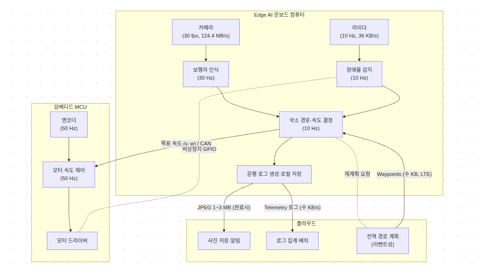

# 모듈 ①과제 - 배달로봇_온보딩

## 문제1.배달 로봇의 연산 분담과 실시간성 설계

### 문제 1-1-1. 4륜 배달 로봇 데이터

| 장치 | 갱신 주기(Hz) | 1회 데이터 | 데이터율 | 비고 |
| :--- | :--- | :--- | :--- | :--- |
| **2D 라이다** | 15Hz | 공개 본문에 1회 데이터 크기가 명시되지 않음 | 공개 본문에 명시되지 않음 | |
| **RGB 카메라** | 60fps · 720p | 공개 본문에 픽셀 형식과 픽셀당 바이트 수가 명시되지 않음 | 계산 가정에 따른 결과는 문제 1-1-3에 제시 | |
| **IMU** | 400Hz | 공개 본문에 1회 데이터 크기가 명시되지 않음 | 공개 본문에 명시되지 않음 | |
| **바퀴 엔코더** | 2kHz | 공개 본문에 1회 데이터 크기가 명시되지 않음 | 공개 본문에 명시되지 않음 | |
| **모터 드라이버** | 공개 본문에 명시되지 않음 | 공개 본문에 패킷 크기가 명시되지 않음 | 공개 본문에 명시되지 않음 | |
| **LTE 모듈** | | | 업로드 및 다운로드 95~100Mbps | 핑 1~5ms |

* **갱신주기** - 1초 동안 기능을 몇 번 반복 수행해서 데이터를 새로고침하는지
  * 예시 $\rightarrow$ 라이다 $\rightarrow$ 15Hz $\rightarrow$ 1초에 15번 주변 환경을 스캔한 새 데이터를 보냄
* **데이터율 (Data Rate)** - 초당 처리되는 데이터의 총량
  * 1회 데이터 크기 (Bytes) x 갱신 주기(Hz)
  * Byte(B): 데이터 크기의 기본 단위
  * Hz(1/s): 초당 새로고침 횟수
  * Data Rate: 초당 발생하는 데이터 양 (B/s 또는 bps)
* **LTE모듈:** 스마트폰에 들어가는 USIM 및 무선 통신 칩셋을 로봇 메인보드(SoC)에 장착할 수 있도록 만든 하드웨어
  * **SoC**
  * 핑 1~5ms, 업로드 및 다운로드 속도 95~100Mbps

---

### 문제 1-1-2. 로봇 작업 분류(임베디드/ Edge AI/ 클라우드)

**작업:** 모터 속도 제어, 장애물 감지, 보행자 인식, 지도 기반 경로 계획, 배달 완료 사진 업로드, 운행 로그 집계

| 작업 | 임베디드/ Edge AI/ 클라우드 | 근거 |
| :--- | :--- | :--- |
| **모터 속도 제어**<br>$\rightarrow$ 모터 드라이버 | **임베디드**<br>구체적인 지연 예산은 공개 본문에 명시되지 않음 | 모터 속도 제어는 비상 상황에 즉각 반응해야 하므로 임베디드 단계에서 처리되어야 합니다. |
| **장애물 감지**<br>$\rightarrow$ 2D 라이다 | **Edge AI**<br>구체적인 지연 예산은 공개 본문에 명시되지 않음 | 15Hz 라이다 입력을 바탕으로 좌표계 변환과 공간 정보 갱신 등의 연산을 수행해야 하며, 통신 상태와 무관하게 로봇 가까이에서 처리해야 하므로 Edge AI 단계로 배치했습니다. |
| **보행자 인식**<br>$\rightarrow$ RGB 카메라 | **Edge AI**<br>구체적인 지연 예산은 공개 본문에 명시되지 않음 | 60fps·720p 카메라 원시 영상은 LTE 업로드 대역폭보다 데이터율이 크고, 보행자 대응은 통신 왕복에 의존하면 안 되므로 Edge AI로 분류했습니다. |
| **지도 기반 경로 계획** | **클라우드 (글로벌 경로 계획 한정)**<br>지연 예산 $\le \text{수백ms} \sim \text{수초}$ | 큰 틀의 경로를 짜는 ‘글로벌 경로 계획’ 작업 경우, 실시간성 회피와 달리 수초 단위의 지연 예산을 허용 하기에 클라우드로 분류했습니다.<br>로봇의 관제 정도 및 도로 통제 상태를 통합 반영한 글로벌 최적화 연산도 클라우드 단계가 적합합니다. |
| **배달 완료 사진 업로드** | **클라우드**<br>지연 예산 $\le \text{수백ms} \sim \text{수초}$ | 사진 업로드는 로봇 주행 제어나 안전에 영향을 주는 데이터가 아니기 때문에 지연이 발생해도 실질적인 피해가 없습니다. 그리고 개별 메모리에 저장되기 보단, 클라우드 DB에서 관리되는 것이 효율적이거라 생각해 클라우드 단계 배치가 적합합니다. |
| **운행 로그 집계** | **클라우드**<br>지연 예산 $\le \text{수백ms} \sim \text{수초}$ | 주행 중 로깅 버퍼에 누적했다가 주기적($1 \sim 10\text{s}$) 또는 미션 종료 시 모아서 전송하므로 통신 대역폭에 무리를 주지 않습니다. |

---

### 문제 1-1-3. 카메라 원시 영상을 클라우드로 계속 보내면 초당 몇 MB 인지 계산하고, LTE 대역폭과 비교해 그 설계가 왜 성립하지 않는지 수치로 보이세요.

* **RGB카메라**
  * 1회 데이터: 해상도(픽셀 수) * 픽셀 당 바이트
  * 계산 가정: 720p를 $1280 \times 720$ 픽셀, 비압축 RGB를 픽셀당 3Bytes로 가정
  * 1프레임: $1280 \times 720 \times 3 = 2,764,800\text{Bytes} \approx 2.7648\text{MB}$
  * 데이터율: $2,764,800 \times 60\text{fps} = 165,888,000\text{Bytes/s} \approx 165.888\text{MB/s}$
* **LTE 대역폭**
  * 업링크만 대역폭에 해당
    * 업로드 속도 $\rightarrow$ 95~100Mbps
* **비교 설계**
  * RGB 카메라 데이터율: $165.888\text{MB/s} \times 8 = 1,327.104\text{Mbps}$ (비트로 변환)
    * $\text{bps} = \text{bits per second}$
  * RGB 카메라 $= 1,327.104\text{Mbps}$ / LTE 업로드 대역폭 $95\sim100\text{Mbps}$
  * 원시 영상 데이터율은 LTE 최대 업로드 속도 100Mbps의 약 13.27배입니다.

$\therefore$ 통신 대역폭 자체가 부족해 데이터 전송 불가 (병목 현상)

---

### 문제 1-1-4. 같은 작업들을 인지 $\rightarrow$ 판단 $\rightarrow$ 제어 계층에 매핑하고, 계층별 갱신 주기를 적어 멀티레이트 데이터 흐름을 그림이나 표로 정리하세요.

| 작업 | 계층 | 갱신주기 | 실행 위치 | 입력 $\rightarrow$ 출력 |
| :--- | :--- | :--- | :--- | :--- |
| **모터 속도 제어** | 제어 | 공개 본문에 명시되지 않음 | 임베디드 | 목표 속도 + 엔코더 피드백 $\rightarrow$ 모터 PWM/ 전류제어 신호 |
| **장애물 감지** | 인지 | 15Hz(약 66.7ms) | Edge AI | 2D 라이다 거리 데이터 $\rightarrow$ 장애물 좌표/ 거리 정보 |
| **보행자 인식** | 인지 | 60fps(약 16.7ms/프레임) | Edge AI | RGB 카메라 Raw Frame $\rightarrow$ 보행자 Bounding Box 및 위협도 |
| **지도 기반 경로 계획** | 판단 | 1Hz 이하 또는 이벤트성 | 클라우드 | 지도 + 현재위치 + 목적지 $\rightarrow$ 글로벌 경로점(Waypoints) |
| **배달 완료 사진 업로드** | 비실시간 | 이벤트성(1회/배달) | 클라우드 | 카메라 촬영 이미지 file $\rightarrow$ HTTP/MQTT 업로드 및 DB 저장 |
| **운행 로그 집계** | 비실시간 | 공개 본문에 명시되지 않음 | 클라우드 | 운행 로그 $\rightarrow$ 집계 결과 |




### 문제 1-1-5. 여섯 작업을 Hard/ Firm / Soft 실시간으로 분류하고, Hard로 분류한 작업이 마감을 놓치면 어떤 물리적 결과가 생기는지 한줄씩 쓰세요

| 작업 | 분류 |
| :--- | :--- |
| **모터 속도 제어** | **Hard** |
| **장애물 감지** | **Hard** |
| **보행자 인식** | **Firm** |
| **지도 기반 경로 계획** | **Soft** |
| **배달 완료 사진 업로드** | **Soft** |
| **운행 로그 집계** | **Soft** |

* **Hard 분류한 작업이 마감을 놓치면?**
  * **모터 속도 제어**
    * **물리적 결과:** 제어 루프 마감을 놓칠 경우, 목표 감속도 적용이 늦어져 정지 거리가 증가하고 보행자나 장애물과 충돌할 수 있습니다.
    * **근거:** 모터 제어 루프는 바퀴 엔코더 피드백을 받아 제동력을 실시간으로 조율하므로, 제어 시한을 놓치면 브레이크 명령 전달이 늦어집니다.
  * **장애물 감지**
    * **물리적 결과:** 장애물 감지 마감을 놓칠 경우, 최신 장애물 위치를 반영한 비상 정지 명령이 늦어져 충돌할 수 있습니다.
    * **근거:** 위험 인지가 늦어지면 하위 제어기에 정지 신호를 제때 보내지 못합니다.

---

### 문제 1-1-6. 주기 · 지연 · 지터를 이 로봇의 예로 가각 한 문장씩 구분해 설명하세요

* **주기** - 센서 데이터 취득이나 제어 루프가 일정한 시간 간격으로 반복되는 간격을 의미하며, 예를 들어 2D 라이다가 15Hz로 약 66.7ms마다 주변 환경을 스캔하는 반복 간격을 뜻합니다.
* **지연** - 입력부터 출력까지 걸리는 총 소요 시간을 의미하며, 예를 들어 라이다가 장애물을 감지한 순간부터 연산을 거쳐 모터 브레이크가 실제로 작동할 때까지 걸린 시간을 뜻합니다.
* **지터** - 주기나 지연시간이 일정하지 않고 시점마다 불규칙하게 변하는 정도를 의미하며, 예를 들어 약 66.7ms 주기로 들어와야 하는 라이다 데이터의 실제 도착 간격이 매번 달라지는 현상을 뜻합니다.

## 문제2. 원격 접속(SSH)과 센서 장치 경로 고정

### 문제 1-2-1. 온보드 컴퓨터를 대신할 접속 대상을 만듭니다. sudo apt install openssh-server 로 내 리눅스에 sshd 를 올려 ssh 사용자@localhost 로 접속하거나, 가상머신 게스트의 LAN IP 로 접속하세요. 어느 방식을 썼는지 보고서에 명시합니다.

```bash
* **sudo apt install openssh-server**
    - ssh 서버 오픈

    - 출력 결과
    :pa9@pa9-Legion-Pro-5-16IAX10:~$ sudo apt install openssh-server
    [sudo] pa9 암호: 
    죄송합니다만, 다시 시도하십시오.
    [sudo] pa9 암호: 
    패키지 목록을 읽는 중입니다... 완료
    의존성 트리를 만드는 중입니다... 완료
    상태 정보를 읽는 중입니다... 완료        
    패키지 openssh-server는 이미 최신 버전입니다 (1:8.9p1-3ubuntu0.17).
    다음 패키지가 자동으로 설치되었지만 더 이상 필요하지 않습니다:
      libfwupd2 libfwupdplugin5 libgcab-1.0-0 libsmbios-c2
    'sudo apt autoremove'를 이용하여 제거하십시오.
    0개 업그레이드, 0개 새로 설치, 0개 제거 및 206개 업그레이드 안 함.

- **ssh pa9@localhost**
    - 온보드 컴퓨터 (현재 사용하고 있는 컴퓨터)를 대상으로 원격 접속

    - 출력 결과
    :pa9@pa9-Legion-Pro-5-16IAX10:~$ ssh pa9@localhost
    Welcome to Ubuntu 22.04.5 LTS (GNU/Linux 6.8.0-138-generic x86_64)

    * Documentation:  https://help.ubuntu.com
    * Management:     https://landscape.canonical.com
    * Support:        https://ubuntu.com/pro

    Expanded Security Maintenance for Applications is not enabled.

    200 updates can be applied immediately.
    To see these additional updates run: apt list --upgradable

    151 additional security updates can be applied with ESM Apps.
    Learn more about enabling ESM Apps service at https://ubuntu.com/esm

    Last login: Wed Aug 26 14:34:41 2026 from 127.0.0.1

```

### 문제 1-2-2. systemctl status ssh 와 ss -tlnp | grep :22 로 서버가 22번 포트를 듣고 있는지 확인하세요.

```bash
- **systemctl status ssh**
    - ssh 서버 activate 확인

    - 출력 결과
    :pa9@pa9-Legion-Pro-5-16IAX10:~$ systemctl status ssh
    ● ssh.service - OpenBSD Secure Shell server
        Loaded: loaded (/lib/systemd/system/ssh.service; enabled; vendor prese>
        Active: active (running) since Fri 2026-09-04 09:26:23 KST; 26min ago
          Docs: man:sshd(8)
                man:sshd_config(5)
      Main PID: 10229 (sshd)
          Tasks: 1 (limit: 37548)
        Memory: 4.2M
            CPU: 30ms
        CGroup: /system.slice/ssh.service
                └─10229 "sshd: /usr/sbin/sshd -D [listener] 0 of 10-100 startu>

    Sep 04 09:26:23 pa9-Legion-Pro-5-16IAX10 systemd[1]: Starting OpenBSD Secur>
    Sep 04 09:26:23 pa9-Legion-Pro-5-16IAX10 sshd[10229]: Server listening on 0>
    Sep 04 09:26:23 pa9-Legion-Pro-5-16IAX10 sshd[10229]: Server listening on :>
    Sep 04 09:26:23 pa9-Legion-Pro-5-16IAX10 systemd[1]: Started OpenBSD Secure>
    Sep 04 09:52:18 pa9-Legion-Pro-5-16IAX10 sshd[13043]: Accepted publickey fo>
    Sep 04 09:52:18 pa9-Legion-Pro-5-16IAX10 sshd[13043]: pam_unix(sshd:session>
    lines 1-18/18 (END)
```
```bash
- **ss -tlnp | grep :22**
    - 22번 시리얼 포트가 열려 있어 외부 접속을 받을 준비 확인
    - 0.0.0.0: 모든 네트워크 IP로부터 22번 포트 접속 가능하다는 뜻

    - 출력 결과
    :pa9@pa9-Legion-Pro-5-16IAX10:~$ ss -tlnp | grep :22
    LISTEN 0      128          0.0.0.0:22         0.0.0.0:*                                   
    LISTEN 0      128             [::]:22            [::]:*   
```

### 문제 1-2-3. ssh-keygen 으로 키 쌍을 만들고 ssh-copy-id 로 공개키를 등록해 비밀번호 없이 접속되게 하세요. 개인키와 공개키 중 서버에 올라가는 것이 어느 쪽인지, 그렇게 나눠도 안전한 이유를 한 줄로 적으세요.

```bash
- **ssh-keygen***
  - 암호키 생성
  - 출력 결과
  :pa9@pa9-Legion-Pro-5-16IAX10:~$ ssh-keygen
  Generating public/private rsa key pair.
  Enter file in which to save the key (/home/pa9/.ssh/id_rsa): 
  /home/pa9/.ssh/id_rsa already exists.
  Overwrite (y/n)? y
  Enter passphrase (empty for no passphrase): 
  Enter same passphrase again: 
  Your identification has been saved in /home/pa9/.ssh/id_rsa
  Your public key has been saved in /home/pa9/.ssh/id_rsa.pub
  The key fingerprint is:
  SHA256:ec5r8cM+GB7rGunsioxfdMg0LkGZMuuRWbilvGHBFe8 pa9@pa9-Legion-Pro-5-16IAX10
  The key's randomart image is:
  +---[RSA 3072]----+
  | . o++           |
  |  *.=.           |
  | . %. +          |
  |  @  * o .       |
  | o +. E S .      |
  |  o  o . =+      |
  |      . o.oO     |
  |   o o o .=.=    |
  |  ..+ .o=+o..o   |
  +----[SHA256]-----+
```
```bash
- **ssh-copy-id pa9@localhost**
  - 생성된 키를 온보드 컴퓨터에 등록
    - 등록 후 원격접속을 다시하더라도 비밀번호 입력 없이 접송 가능

  - 출력 결과
  : pa9@pa9-Legion-Pro-5-16IAX10:~$ ssh-copy-id pa9@localhost
  /usr/bin/ssh-copy-id: INFO: Source of key(s) to be installed: "/home/pa9/.ssh/id_rsa.pub"
  /usr/bin/ssh-copy-id: INFO: attempting to log in with the new key(s), to filter out any that are already installed
  /usr/bin/ssh-copy-id: INFO: 1 key(s) remain to be installed -- if you are prompted now it is to install the new keys

  Number of key(s) added: 1

  Now try logging into the machine, with:   "ssh 'pa9@localhost'"
  and check to make sure that only the key(s) you wanted were added.

  - 생성된 키 목록 확인 명령어
    - ls -l ~/.ssh
- *서버에 등록되어 올라가는 것은 공개키 입니다.*
  - 공개키를 수학적으로 역산해 개인키(비밀키)를 알아내는 것은 불가능하기 때문에 서로 나누어져도 안전합니다.
 ```
 ### 문제 1-2-4. 접속한 세션이 진짜 원격 세션임을 증명하세요 — who 출력의 pts/N 과 echo $SSH_CONNECTION 값을 붙입니다.   
 ```bash
- ** who **
  - :1 -> 로컬 로그인
  - pt.4 // (127.0.0.1)
    - pts(Pseudo Treminal) -> 가상 터미널
    - (127.0.0.1) -> 직접 터미널을 열면 IP 표시 안되지만, SSH 접속 시 IP 괄호에 찍힘000

  - 출력 결과
  :pa9@pa9-Legion-Pro-5-16IAX10:~$ who
  pa9      :1           2026-09-04 08:50 (:1)
  pa9      pts/3        2026-09-04 09:52 (127.0.0.1)

- echo $SSH_CONNECTION   # echo -> print() 같은 명령어
  - 127.0.0.1 44956 127.0.0.1 22 
  - [클라이언트 IP] [클라이언트 포트] [서버 IP] [서버 SSH 포트]

  - 출력 결과
  :pa9@pa9-Legion-Pro-5-16IAX10:~$ echo $SSH_CONNECTION
  127.0.0.1 52816 127.0.0.1 22

```
### 문제 1-2-5. 헤드리스 운용에서 자주 쓰는 두 가지를 각각 한 번 수행하세요 — 접속하지 않고 명령만 실행(ssh 사용자@서버 'uname -a'), scp 로 파일 전송.

```bash
- **scp test.py pa@localhost:~/test**
  - ssh 접속해있는 터미널 외에 새로운 창을 열어 내가 원하는 파일(ex test.py)을 내가 원하는 폴더(ex test)에 전송

  - 출력 결과
  :pa9@pa9-Legion-Pro-5-16IAX10:~$ scp test.py pa9@localhost:~/test
  test.py                                   100%   76   124.4KB/s   00:00    
  pa9@pa9-Legion-Pro-5-16IAX10:~$ cd test
  pa9@pa9-Legion-Pro-5-16IAX10:~/test$ ls
  test.py

- **ssh pa@localhost 'uname -a'**
  - ssh [접속대상]   [원격 실행할 명령어]
  - 원격 서버에 직접 로그인하여 터미널을 열지 않고, 특정 명령어 하나만 원격으로 실행한 뒤 결과만 출력하고 바로 접속 종료
  - 출력 결과
  :pa9@pa9-Legion-Pro-5-16IAX10:~$ ssh pa9@localhost 'uname -a'
  Linux pa9-Legion-Pro-5-16IAX10 6.8.0-138-generic #138~22.04.1-Ubuntu SMP PREEMPT_DYNAMIC Fri Aug  7 13:43:15 UTC  x86_64 x86_64 x86_64 GNU/Linux

```

### 문제 1-2-6. 접속한 환경에서 ls -l /dev/tty* 로 시리얼 장치 파일을 확인하고, 파일 종류 문자와 소유 그룹을 기록하세요(3강의 권한).
- ls -l /dev/tty*
  - 출력 결과
  :pa9@pa9-Legion-Pro-5-16IAX10:~$ ls -l /dev/tty*
  crw-rw-rw- 1 root tty     5,  0 Sep  4 08:48 /dev/tty
  crw--w---- 1 root tty     4,  0 Sep  4 08:49 /dev/tty0
  crw--w---- 1 root tty     4,  1 Sep  4 08:49 /dev/tty1
  crw--w---- 1 root tty     4, 10 Sep  4 08:48 /dev/tty10
  crw--w---- 1 root tty     4, 11 Sep  4 08:48 /dev/tty11
  crw--w---- 1 root tty     4, 12 Sep  4 08:48 /dev/tty12

    - c: 해당 파일이 바이트 단위로 데이터를 처리하는 문자 디바이스 파일임을 뜻하며, 키보드, 터미널 같은 하드웨어 장치와 입출력 수행
    - rw-rw-rw- // --w----: 접근 권한 상태 표시 -> r: 읽기, w: 쓰기, x: 실행
    - dev/tty: 모든 사용자 읽고, 쓰기 가능
    - dev/tty1: 소유자 및 그룹만 쓰기 가능
    - root: 해당 장치 파일을 관리하는 소유자
    - tty: 소속 그룹
    - 장치 번호 (5, 0 또는 4, 1): 커널이 하드웨어 장치를 구별하기 위해 사용하는 주 번호 및 부 번호
    - sep 4 08:48: 해당 장치 파일이 시스템에 생성되거나 마지막으로 접근/상태가 갱신된 날짜

### 문제 1-2-7. 아래 코드로 라이다·IMU 역할을 할 loop 장치 두 개를 붙여 센서 두 대가 동시에 꽂힌 상황을 만드세요. USB 하드웨어는 필요하지 않습니다.
- loop 장치: 리눅스 커널의 가상 블록 디바이스 기능 // 일반 파일을 마치 HDD나 USB 처럼 다룰 수 있게 만들어주는 가상 장치

```bash
- truncate -s 16M lidar.img
- truncate -s 24M imu.img
- 출력 결과
:pa9@pa9-Legion-Pro-5-16IAX10:~$ mkdir -p fake_sensors
pa9@pa9-Legion-Pro-5-16IAX10:~$ cd fake_sensors/
pa9@pa9-Legion-Pro-5-16IAX10:~/fake_sensors$ truncate -s 16M lidar.img
pa9@pa9-Legion-Pro-5-16IAX10:~/fake_sensors$ truncate -s 24M imu.img
pa9@pa9-Legion-Pro-5-16IAX10:~/fake_sensors$ ls
imu.img  lidar.img

- sudo losetup -f --show lidar.img
- sudo losetup -f --show imu.img
- 출력 결과
:pa9@pa9-Legion-Pro-5-16IAX10:~/fake_sensors$ sudo losetup -f --show lidar.img
[sudo] pa9 암호: 
/dev/loop18
pa9@pa9-Legion-Pro-5-16IAX10:~/fake_sensors$ sudo losetup -f --show imu.img
/dev/loop19

- losetup -a
- 출력 결과
:pa9@pa9-Legion-Pro-5-16IAX10:~/fake_sensors$ losetup -a
/dev/loop1: []: (/var/lib/snapd/snaps/core20_2866.snap)
/dev/loop19: []: (/home/pa9/fake_sensors/imu.img)
/dev/loop17: []: (/var/lib/snapd/snaps/snapd-desktop-integration_391.snap)
/dev/loop8: []: (/var/lib/snapd/snaps/gnome-42-2204_263.snap)
/dev/loop15: []: (/var/lib/snapd/snaps/snapd_27710.snap)
/dev/loop6: []: (/var/lib/snapd/snaps/firefox_8803.snap)
/dev/loop13: []: (/var/lib/snapd/snaps/snap-store_1216.snap)
/dev/loop4: []: (/var/lib/snapd/snaps/core24_1643.snap)
/dev/loop11: []: (/var/lib/snapd/snaps/gtk-common-themes_1535.snap)
/dev/loop2: []: (/var/lib/snapd/snaps/core22_2411.snap)
/dev/loop0: []: (/var/lib/snapd/snaps/bare_5.snap)
/dev/loop18: []: (/home/pa9/fake_sensors/lidar.img)
/dev/loop9: []: (/var/lib/snapd/snaps/gnome-46-2404_164.snap)
/dev/loop16: []: (/var/lib/snapd/snaps/snapd-desktop-integration_178.snap)
/dev/loop7: []: (/var/lib/snapd/snaps/gnome-42-2204_176.snap)
/dev/loop14: []: (/var/lib/snapd/snaps/snapd_27591.snap)
/dev/loop5: []: (/var/lib/snapd/snaps/firefox_8754.snap)
/dev/loop12: []: (/var/lib/snapd/snaps/snap-store_1113.snap)
/dev/loop3: []: (/var/lib/snapd/snaps/core22_2437.snap)
/dev/loop10: []: (/var/lib/snapd/snaps/mesa-2404_1839.snap)
```

### 문제 1-2-8. 두 장치를 udevadm info --attribute-walk /dev/loopN 으로 조사해 서로 구분할 수 있는 속성을 찾아 기록하세요(loop/backing_file).
- udevadm info --attribute-walk /dev/loop
  : 해당 loop 디바이스와 연결된 모든 상위 부모 장치들의 속성 정보를 트리구조로 추적하여 상세히 보여줍니다.
```bash
- lidar.img -> loop18
  - udevadm info --attribute-wal /dev/loop18
  - 출력 결과 (**lidar 와 imu 다른 정보만 기록**)
  :pa9@pa9-Legion-Pro-5-16IAX10:~/fake_sensors$ udevadm info --attribute-walk /dev/loop18

Udevadm info starts with the device specified by the devpath and then
walks up the chain of parent devices. It prints for every device
found, all possible attributes in the udev rules key format.
A rule to match, can be composed by the attributes of the device
and the attributes from one single parent device.

  looking at device '/devices/virtual/block/loop18':
    KERNEL=="loop18"
    SUBSYSTEM=="block"
   
    ATTR{diskseq}=="41"

    ATTR{size}=="32768"
    ATTR{stat}=="      79        0     1372        0        0        0        0        0        0        0        0        0        0        0        0        0        0"
  
- imu.img -> loop19
  - udevadm info --attribute-wal /dev/loop19
  - 출력 결과 (**lidar 와 imu 다른 정보만 기록**)
  :pa9@pa9-Legion-Pro-5-16IAX10:~/fake_sensors$ udevadm info --attribute-walk /dev/loop19

Udevadm info starts with the device specified by the devpath and then
walks up the chain of parent devices. It prints for every device
found, all possible attributes in the udev rules key format.
A rule to match, can be composed by the attributes of the device
and the attributes from one single parent device.

  looking at device '/devices/virtual/block/loop19':
    KERNEL=="loop19"
    SUBSYSTEM=="block"
  
    ATTR{diskseq}=="43"

    ATTR{size}=="49152"
    ATTR{stat}=="      68        0     1344        0        0        0        0        0        0        0        0        0        0        0        0        0        0"

  - backing file 관련
  - 출력 결과
  :pa9@pa9-Legion-Pro-5-16IAX10:~$ losetup -l -O NAME,BACK-FILE /dev/loop18
  NAME        BACK-FILE
  /dev/loop18 /home/pa9/fake_sensors/lidar.img
  pa9@pa9-Legion-Pro-5-16IAX10:~$ losetup -l -O NAME,BACK-FILE /dev/loop19
  NAME        BACK-FILE
  /dev/loop19 /home/pa9/fake_sensors/imu.img

```
### 문제 1-2-9. /etc/udev/rules.d/99-robot-sensor.rules 에 규칙 두 개를 작성해 각각 /dev/robot_lidar, /dev/robot_imu 라는 고정 이름을 갖게 하세요.
- /etc/udev/rules.d/99-robot-sensor.rules 에 규칙 작성
- sudo nano /etc/udev/rules.d/99-robot-sensor.rules
- 출력 결과
```bash
# fake sensors udev rules


#lidar.img
#size -> 32768
 
KERNEL=="loop*", SUBSYSTEM=="block", ATTR{size}=="32768", SYMLINK+="robot_lidar", MODE="0666"

#imu.img
#size -> 49152
KERNEL=="loop*", SUBSYSTEM=="block", ATTR{size}=="49152", SYMLINK+="robot_imu", MODE="0666"
```
```bash
- sudo udevadm trigger --action=add /dev/loop18 /dev/loop19
- ls -l /dev/robot/
- 출력 결과
:pa9@pa9-Legion-Pro-5-16IAX10:~/physicalai-lv1-assignments$ sudo udevadm trigger --action=add /dev/loop18 /dev/loop19
pa9@pa9-Legion-Pro-5-16IAX10:~/physicalai-lv1-assignments$ ls -l /dev/robot
합계 0
lrwxrwxrwx 1 root root 9 Sep  4 11:38 imu -> ../loop19
lrwxrwxrwx 1 root root 9 Sep  4 11:38 lidar -> ../loop18
```

### 문제 1-2-10. 작성한 규칙을 문서화하세요 — 쓴 키(SUBSYSTEM, KERNEL, ATTR{...}, SYMLINK+=, MODE, GROUP)의 뜻과 == 와 =·+= 의 차이를 표로 정리합니다.

#### udev 규칙에 사용한 키

| 키(Key) | 분류 | 설명 및 용도 | 작성 규칙에서의 의미 |
| :--- | :---: | :--- | :--- |
| `SUBSYSTEM` | 매칭 조건 | 장치가 속한 서브시스템을 검사합니다. 예를 들어 블록 장치는 `block`, 시리얼 장치는 `tty`에 속합니다. | `SUBSYSTEM=="block"`으로 loop 장치가 블록 장치인지 확인합니다. |
| `KERNEL` | 매칭 조건 | 커널이 장치에 부여한 이름을 검사합니다. `*`, `?` 등의 와일드카드를 사용할 수 있습니다. | `KERNEL=="loop*"`로 이름이 `loop`로 시작하는 장치만 선택합니다. |
| `ATTR{속성명}` | 매칭 조건 | `/sys`에 등록된 현재 장치의 sysfs 속성값을 검사합니다. | `ATTR{size}=="32768"`과 `ATTR{size}=="49152"`로 두 loop 장치를 구분합니다. |
| `SYMLINK+=` | 할당 동작 | 실제 장치 파일을 가리키는 추가 심볼릭 링크를 `/dev` 아래에 생성합니다. | 각각 `/dev/robot_lidar`와 `/dev/robot_imu` 링크를 생성합니다. |
| `MODE` | 할당 동작 | 장치 파일의 접근 권한을 8진수로 지정합니다. | `MODE="0666"`은 소유자·그룹·기타 사용자 모두에게 읽기와 쓰기 권한을 부여합니다. |
| `GROUP` | 할당 동작 | 장치 파일의 소유 그룹을 지정합니다. | `GROUP="disk"`로 장치 파일의 소유 그룹을 `disk`로 지정합니다. |

#### udev 연산자의 차이

| 연산자 | 역할 | 설명 | 사용 예시 |
| :---: | :--- | :--- | :--- |
| `==` | 조건 비교 | 왼쪽 키의 값이 오른쪽 값과 일치하는지 검사합니다. 모든 매칭 조건이 참일 때 같은 규칙에 있는 할당 동작이 실행됩니다. | `SUBSYSTEM=="block"`<br>`ATTR{size}=="32768"` |
| `=` | 값 할당 | 해당 키의 현재 값을 지정한 값으로 설정합니다. 이후의 다른 규칙에서 다시 변경될 수 있습니다. | `MODE="0666"`<br>`GROUP="disk"` |
| `+=` | 값 추가 | 기존 값 목록을 유지하면서 새 값을 추가합니다. 여러 값을 가질 수 있는 `SYMLINK`, `TAG`, `RUN` 등에 사용합니다. | `SYMLINK+="robot_lidar"` |

즉, `==`는 장치를 찾기 위한 **조건 비교 연산자**이고, `=`과 `+=`는 조건에 맞는 장치의 설정을 바꾸는 **할당 연산자**입니다. `=`은 값을 설정하고, `+=`는 기존 목록에 값을 추가한다는 차이가 있습니다.

### 문제 1-2-11. 같은 규칙을 실제 USB 시리얼 센서(라이다 idVendor 10c4/idProduct ea60, IMU 10c4/ea70)에 적용한다면 어떤 키로 바꿔야 하는지 규칙 초안을 적고, idVendor 가 같고 idProduct 만 다른 상황을 어떻게 구분할지 근거를 쓰세요.

- 라이다
  - idVendor -> 10c4
  - idProduct -> ea60
-IMU
  - idVendor -> 10c4
  - idProduct -> ea70

- 규칙 초안
#lidar
 
KERNEL=="ttyUSB*", SUBSYSTEM=="tty", ATTRS{idVendor}=="10c4", ATTRS{idProduct}=="ea60", SYMLINK+="robot_lidar", MODE="0666"

#imu
KERNEL=="ttyUSB*", SUBSYSTEM=="tty", ATTRS{idVendor}=="10c4", ATTRS{idProduct}=="ea70", SYMLINK+="robot_imu", MODE="0666"

 - 구분 근거: 라이다와 IMU가 idVendor가 '10c4'로 같으므로 서로 구분할 수 없으므로, 상이한 idProduct로 구분짓는 것이 맞습니다.


## 문제3. 팀 저장소 협업 - 브랜치·충돌 해결·PR·리뷰

### 문제 1-3-1. GitHub에 연습용 공개 저장소를 만들고 clone 한 뒤, README.md 에 배달 로봇 사양(센서 목록·주기)을 적어 첫 커밋을 push 하세요.

- 저장소 URL: https://github.com/SpartaPA/physicalai-lv1-taeyoungMoon
- PR URL: https://github.com/SpartaPA/physicalai-lv1-taeyoungMoon/pull/1
